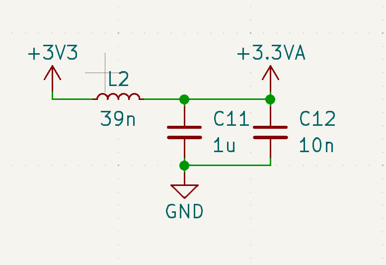

# Power-Filter

This is a schematic diagram of a simple power filter or power supply isolation network, often used to clean and stabilize a power supply for analog or sensitive components. Let's go over each part of the circuit:

### Purpose:
This design is aimed at isolating and filtering noise from the 3.3V power supply to create a cleaner, more stable voltage (`+3.3VA`), which is often used for analog circuits or sensitive ICs (denoted by the "A" in 3.3VA). The circuit works by attenuating high-frequency noise and ensuring stable voltage for these components.

### Explanation:

1. **Inductor (L2 - 39nH):**
   - The inductor is placed in series between the input voltage (`+3V3`) and the output voltage (`+3.3VA`).
   - The inductance value (39nH) provides a high impedance to high-frequency noise, meaning it blocks or reduces high-frequency noise signals, allowing only low-frequency (or DC) to pass through to the output (`+3.3VA`).
   - This ensures that high-frequency switching noise or other transients from the `+3V3` rail do not affect the sensitive components powered by `+3.3VA`.

2. **Capacitors (C11 - 1µF and C12 - 10nF):**
   - These capacitors are connected in parallel between the filtered voltage (`+3.3VA`) and GND.
   - **C11 (1µF)**: This larger capacitor handles lower-frequency noise or voltage dips, helping stabilize the power supply in the low-frequency range.
   - **C12 (10nF)**: This smaller capacitor filters out high-frequency noise, working together with the inductor to suppress noise on the `+3.3VA` power line.
   - By combining capacitors with different values, the circuit can filter noise across a wide range of frequencies. 

3. **Power Supply Filtering Network:**
   - The combination of the inductor and capacitors forms a low-pass filter. This filter allows the steady DC voltage (3.3V) to pass through to the output (`+3.3VA`), while reducing or eliminating high-frequency noise, ripples, or transients that could affect sensitive components.
   - The filtered voltage (`+3.3VA`) is typically used for analog components such as ADCs, DACs, or sensitive analog ICs that require a clean, stable power supply.

4. **Ground (GND):**
   - The ground provides a return path for the filtered current, ensuring that the capacitors have a stable reference point for filtering the power supply.

### Application:
- This type of filtering is essential in mixed-signal designs where both analog and digital components are used. Digital circuits can generate high-frequency noise that can couple into analog circuits, degrading their performance. The filter helps isolate the analog voltage rail from such noise.
  
- By isolating the `+3.3VA` rail with an inductor and capacitors, this circuit ensures that the sensitive analog components or other noise-sensitive circuits are shielded from the noise and fluctuations on the main `+3V3` rail.

In summary, this circuit is a power filtering stage used to create a cleaner analog supply (`+3.3VA`) from a noisy digital supply (`+3V3`) by using an inductor and capacitors to filter out unwanted high-frequency noise.

The part you are describing in this schematic is typically called a **Pi Filter** or **LC Filter**.

- **Pi Filter**: It is called this because of the resemblance of the circuit topology to the Greek letter "π." The two capacitors (C11, C12) and the inductor (L2) form the shape of the letter π. This is a common filter design used to smooth or clean power supplies.
  
- **LC Filter**: This name refers to the components used: an inductor (L) and capacitors (C). It's often used to reduce noise, especially in sensitive analog or mixed-signal circuits.

In this case, since it is a combination of an inductor and capacitors, it can be referred to as either a **Pi Filter** or **LC Filter** in the context of power supply filtering.