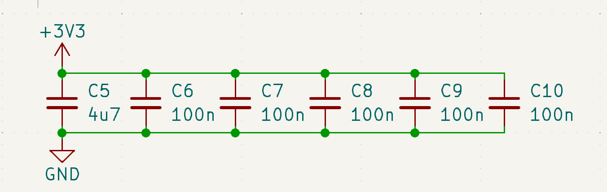

# Decoupling

This is a schematic diagram that shows a power supply decoupling network using capacitors. As a PCB hardware expert, here’s a breakdown of the purpose and design:

### Purpose:
This circuit is used for decoupling or bypassing, which helps stabilize the power supply by filtering out high-frequency noise and ensuring that the supplied voltage (3.3V in this case) is stable for sensitive components.

### Explanation:

1. **Capacitors in Parallel:**
   - The capacitors (C5, C6, C7, C8, C9, C10) are all connected in parallel between the +3.3V power rail and GND.
   - Capacitors are used to store and release charge quickly, which helps in smoothing out any voltage spikes or dips on the power line.
  
2. **Different Capacitor Values:**
   - **C5 (4.7µF):** This is a larger value capacitor and provides bulk decoupling. It helps to handle low-frequency noise or dips in voltage by storing more charge.
   - **C6, C7, C8, C9, C10 (100nF):** These are smaller value capacitors used for high-frequency decoupling. They respond quickly to high-frequency noise (like from switching power supplies or digital circuits) and filter it out to keep the voltage stable.
  
3. **Decoupling Network Design:**
   - Using multiple capacitors with different values in parallel provides broad coverage over a range of frequencies, as the smaller capacitors handle high-frequency noise, while the larger capacitors handle low-frequency noise.
   - This is a common practice in PCB design, especially for sensitive ICs and high-speed circuits, to prevent noise from affecting the functionality of the circuit.

4. **Placement on PCB:**
   - These capacitors should be placed as close as possible to the power supply pins of the components they are protecting, especially in microcontrollers, digital ICs, or sensitive analog components.
   - The larger capacitor (C5) is typically placed near the power input to the PCB, while the smaller capacitors are placed closer to individual components.

In summary, this is a power decoupling circuit designed to clean the power supply (3.3V in this case) by filtering out unwanted noise, ensuring stable operation for the components that use this power line.