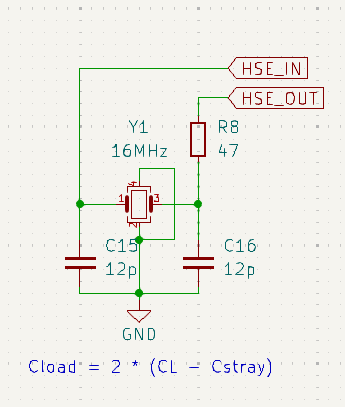

# Crystal Oscillator

This schematic is showing a **crystal oscillator circuit**, specifically a **high-speed external (HSE)** oscillator configuration for providing a stable clock signal to a microcontroller or other digital ICs. Let's go through each component and its function:

### Purpose:
This circuit is designed to generate a stable 16 MHz clock signal for the microcontroller or other digital components. Crystals are commonly used for precise timing in digital circuits, such as controlling clock signals for CPUs, communication protocols, and other timing-critical components.

### Explanation:

1. **Crystal (Y1 - 16 MHz):**
   - The crystal (Y1) is the primary component in this oscillator circuit and is responsible for generating a precise 16 MHz clock signal.
   - A crystal operates by vibrating at a specific frequency (16 MHz here) when an AC signal is applied to it, generating a highly stable and accurate clock signal.
   - In this case, the crystal is connected between two pins, **HSE_IN** and **HSE_OUT**, which are typically the clock input/output pins of a microcontroller.

2. **Capacitors (C15 - 12pF, C16 - 12pF):**
   - These capacitors are used for load capacitance, and they are connected between each leg of the crystal and ground (GND).
   - The purpose of the capacitors is to stabilize the crystal's oscillation frequency and ensure proper operation. The value of the load capacitors is critical because it directly affects the frequency accuracy of the crystal.
   - The equation shown at the bottom of the schematic, **Cload = 2 * (CL - Cstray)**, helps you determine the correct capacitance value by considering both the crystal's rated load capacitance (CL) and the parasitic or stray capacitance (Cstray) present in the PCB traces.

3. **Resistor (R8 - 47Ω):**
   - This resistor is placed in series with the output (HSE_OUT) and is called a **damping resistor**.
   - The purpose of this resistor is to dampen or limit any excessive oscillations and reduce signal ringing or noise in the circuit, ensuring a clean clock signal. Without this resistor, the output might produce high-frequency noise or harmonics that could interfere with the rest of the circuit.

4. **HSE_IN and HSE_OUT:**
   - These are the connections to the **High-Speed External oscillator** (HSE) pins of a microcontroller or other clock-driven ICs.
   - **HSE_IN** is where the microcontroller takes the input clock signal, and **HSE_OUT** is where the clock signal is generated by the oscillator circuit and fed back into the microcontroller's internal clock circuit.

5. **Ground (GND):**
   - The capacitors are tied to ground to complete the oscillating circuit and provide a stable reference voltage. The ground connection is critical to ensure that the crystal oscillates at its intended frequency without any noise or instability.

### Application:
- This type of crystal oscillator circuit is commonly found in microcontroller designs (such as STM32, AVR, or other embedded systems) where precise timing is necessary. It could be used for controlling the system clock, real-time clocks, or in communication peripherals that require an accurate clock source.
  
- The use of external crystals like this ensures that the microcontroller runs at the precise frequency required by the application, especially in timing-sensitive tasks or communication protocols.

### Summary:
This circuit is a standard **16 MHz crystal oscillator** setup used for generating a stable clock signal for a microcontroller. The crystal (Y1), together with the load capacitors (C15, C16) and damping resistor (R8), creates a stable oscillating signal that is fed into the HSE_IN and HSE_OUT pins of the microcontroller to provide a precise clock source. The values of the components are carefully chosen to ensure the correct frequency and stability of the oscillation.

